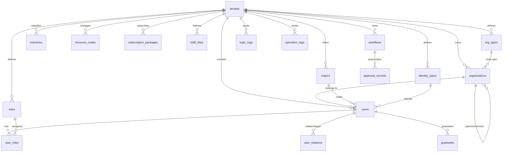

# 数据表结构及关联文档（最终版）

> 基于五个项目前端页面逐项逆向，经多轮对齐确认。本文档为数据库建表唯一参考。

---

## 项目与表归属清单

| 项目 | 拥有表（数量） |
|------|--------|
| backend | tenants(1), organizations(2), org_types(3), majors(4), industries(5), resource_codes(6), subscription_packages(7), users(8), identity_types(9), user_extension_fields(10), user_relations(11), graduates(12), staff_titles(13), roles(14), user_roles(15), login_logs(16), operation_logs(17), app_modules(18), platform_links(19), workflows(20), approval_records(21) |
| job | career_positions(1), position_certificates(2), position_responsibilities(3), ability_points(4), position_ability_bindings(5), ability_domains(6), batches(7), position_recommendations(8), banner_configs(9), learn_roads(10) |
| scene | scenarios(1), scenario_tasks(2), task_knowledge_bindings(3), task_ability_bindings(4), task_resources(5), task_resource_bindings(6), task_deliverables(7), task_evaluation_configs(8), task_eval_points(9), task_review_steps(10), scenario_weight_configs(11), scenario_grade_mappings(12), batches(13), scene_archives(14) |
| lesson | courses(1), knowledge_points(2), system_course_nodes(3), node_quizzes(4), node_quiz_questions(5), node_homeworks(6), hybrid_node_modules(7), node_resources(8), course_knowledge_bindings(9), batches(10) |
| evaluation | question_banks(1), questions(2), exams(3), exam_questions(4), exam_usages(5), evaluation_method_categories(6), evaluation_methods(7), scene_evaluation_results(8), job_ability_results(9), certification_rules(10), certification_ability_items(11), certification_ability_points(12), certification_related_tasks(13), student_ability_portraits(14), student_ability_archives(15), graduation_project_topics(16), graduation_project_archives(17), graduation_project_evaluations(18), graduation_query_results(19), micro_cert_templates(20), cert_issuance_records(21), credit_conversion_rules(22), appeal_records(23), batches(24) |

---

## 共享实体（目标架构）

```
SHARED (single source of truth):
  users              → SOURCE: backend,  REFERENCED BY: all
  organizations      → SOURCE: backend,  REFERENCED BY: all
  majors             → SOURCE: backend,  REFERENCED BY: job, lesson
  industries         → SOURCE: backend,  REFERENCED BY: job
  identity_types     → SOURCE: backend,  REFERENCED BY: all
  workflows          → SOURCE: backend,  REFERENCED BY: all
  approval_records   → SOURCE: backend,  REFERENCED BY: all
  knowledge_points   → SOURCE: lesson,   REFERENCED BY: scene, evaluation, (all)
  ability_points     → SOURCE: job,      REFERENCED BY: scene, evaluation, (all)
  question_banks     → SOURCE: evaluation, REFERENCED BY: scene, lesson, (all)  — 题库公共资源
  questions          → SOURCE: evaluation, REFERENCED BY: scene, lesson, (all)  — 题目公共资源
  exams              → SOURCE: evaluation, REFERENCED BY: scene, lesson, (all)  — 试卷公共资源
  exam_usages        → SOURCE: evaluation, REFERENCED BY: (all)                   — 考试场次
  career_positions   → SOURCE: job,      REFERENCED BY: scene, evaluation
  scenarios          → SOURCE: scene,    REFERENCED BY: evaluation
  scenario_tasks     → SOURCE: scene,    REFERENCED BY: evaluation

PER-PROJECT (independent):
  batches → per-project (job/scene/lesson/evaluation batches differ)
  resources → per-project (scene pool ≠ lesson pool)
```

---

## TABLE DEFINITIONS

### SECTION 1: zhiyu-backend

```sql
-- ==================== 1. tenants ====================
CREATE TABLE tenants (
  id UUID PRIMARY KEY, name VARCHAR(128) NOT NULL, code VARCHAR(64) UNIQUE NOT NULL,
  logo_url TEXT, contact VARCHAR(128), phone VARCHAR(32),
  domain VARCHAR(256), address TEXT, enterprise_code VARCHAR(64), description TEXT,
  admin_ids UUID[], status VARCHAR(16) DEFAULT 'active',
  created_at TIMESTAMP DEFAULT NOW(), updated_at TIMESTAMP DEFAULT NOW()
);

-- ==================== 2. organizations (tree) ====================
-- student-line: 学校→二级学院→专业→班级
-- teacher-line: 学校→二级学院→行政职能部门
CREATE TABLE organizations (
  id UUID PRIMARY KEY, tenant_id UUID NOT NULL REFERENCES tenants(id),
  name VARCHAR(128) NOT NULL, type_id UUID NOT NULL,  -- FK→org_types
  parent_id UUID REFERENCES organizations(id),
  sort_order INT DEFAULT 0, member_count INT DEFAULT 0
);

-- ==================== 3. org_types ====================
CREATE TABLE org_types (
  id UUID PRIMARY KEY, tenant_id UUID NOT NULL REFERENCES tenants(id),
  name VARCHAR(64) NOT NULL, category VARCHAR(16) NOT NULL,  -- internal|business|external
  description TEXT, created_at TIMESTAMP DEFAULT NOW()
);

-- ==================== 4. majors ====================
CREATE TABLE majors (
  id UUID PRIMARY KEY, tenant_id UUID NOT NULL REFERENCES tenants(id),
  org_node_id UUID REFERENCES organizations(id),
  code VARCHAR(64) NOT NULL, name VARCHAR(128) NOT NULL,
  alias VARCHAR(128), enabled BOOLEAN DEFAULT TRUE
);

-- ==================== 5. industries (two-level) ====================
CREATE TABLE industries (
  id UUID PRIMARY KEY, tenant_id UUID NOT NULL REFERENCES tenants(id),
  code VARCHAR(64) NOT NULL, name VARCHAR(128) NOT NULL,
  parent_id UUID REFERENCES industries(id),  -- NULL=一级大类, not NULL=二级中类
  enabled BOOLEAN DEFAULT TRUE, sort_order INT DEFAULT 0
);

-- ==================== 6. resource_codes ====================
CREATE TABLE resource_codes (
  id UUID PRIMARY KEY, tenant_id UUID NOT NULL REFERENCES tenants(id),
  code VARCHAR(64) NOT NULL, name VARCHAR(128) NOT NULL,
  description TEXT, type VARCHAR(16) NOT NULL,  -- public|custom
  created_at TIMESTAMP DEFAULT NOW()
);

-- ==================== 8. subscription_packages ====================
CREATE TABLE subscription_packages (
  id UUID PRIMARY KEY, tenant_id UUID NOT NULL REFERENCES tenants(id),
  name VARCHAR(128) NOT NULL, valid_until DATE,
  modules JSONB NOT NULL,  -- {platform: {modules: [{key,enabled}]}}
  status VARCHAR(16) DEFAULT 'active',
  created_at TIMESTAMP DEFAULT NOW()
);

-- ==================== 9. users ====================
CREATE TABLE users (
  id UUID PRIMARY KEY, tenant_id UUID NOT NULL REFERENCES tenants(id),
  name VARCHAR(64) NOT NULL, email VARCHAR(128), phone VARCHAR(32), avatar_url TEXT,
  identity_type_id UUID NOT NULL REFERENCES identity_types(id),
  org_node_id UUID REFERENCES organizations(id),
  major_id UUID REFERENCES majors(id),
  student_no VARCHAR(64), work_id VARCHAR(64), id_card VARCHAR(32),
  title_ids UUID[],  -- FK→staff_titles
  login_name VARCHAR(64) UNIQUE, password_hash VARCHAR(256),
  oauth JSONB,       -- {wechat?, dingtalk?, feishu?}
  last_login_at TIMESTAMP,
  status VARCHAR(16) DEFAULT 'active',
  -- student enrollment: 在籍|休学|退学|毕业|结业
  -- staff: 在职|离职|外聘
  created_at TIMESTAMP DEFAULT NOW(), updated_at TIMESTAMP DEFAULT NOW()
);

-- ==================== 9. identity_types ====================
CREATE TABLE identity_types (
  id UUID PRIMARY KEY, tenant_id UUID NOT NULL REFERENCES tenants(id),
  code VARCHAR(64) NOT NULL, name VARCHAR(64) NOT NULL,
  description TEXT, user_count INT DEFAULT 0,
  is_system BOOLEAN DEFAULT FALSE,  -- system types cannot be deleted
  created_at TIMESTAMP DEFAULT NOW()
);

-- ==================== 12. user_extension_fields ====================
CREATE TABLE user_extension_fields (
  id UUID PRIMARY KEY, tenant_id UUID NOT NULL REFERENCES tenants(id),
  field_key VARCHAR(64) NOT NULL UNIQUE, field_name VARCHAR(64) NOT NULL,
  field_type VARCHAR(16) NOT NULL,  -- text|number|date|select
  is_enabled BOOLEAN DEFAULT TRUE, is_required BOOLEAN DEFAULT FALSE,
  applicable_identity_type_ids UUID[],  -- FK→identity_types
  slot_number INT NOT NULL CHECK(slot_number BETWEEN 1 AND 20)
);

-- ==================== 13. user_relations ====================
CREATE TABLE user_relations (
  id UUID PRIMARY KEY, tenant_id UUID NOT NULL REFERENCES tenants(id),
  initiator_id UUID NOT NULL REFERENCES users(id),
  initiator_org_node_id UUID REFERENCES organizations(id),
  target_id UUID NOT NULL REFERENCES users(id),
  target_org_node_id UUID REFERENCES organizations(id),
  relation_type VARCHAR(16) NOT NULL,  -- 上下级|业务协同|管理关系|服务关系|项目参与|外部合作
  description TEXT,
  created_at TIMESTAMP DEFAULT NOW()
);

-- ==================== 14. graduates ====================
CREATE TABLE graduates (
  id UUID PRIMARY KEY, tenant_id UUID NOT NULL REFERENCES tenants(id),
  user_id UUID REFERENCES users(id),
  name VARCHAR(64) NOT NULL, student_no VARCHAR(64), id_card VARCHAR(32),
  enroll_year INT, graduate_year INT,
  major_name VARCHAR(128), class_name VARCHAR(128),
  created_at TIMESTAMP DEFAULT NOW()
);

-- ==================== 15. staff_titles (学校内部职位/职称) ====================
-- NOT the same as job.career_positions
CREATE TABLE staff_titles (
  id UUID PRIMARY KEY, tenant_id UUID NOT NULL REFERENCES tenants(id),
  code VARCHAR(64) NOT NULL, name VARCHAR(64) NOT NULL,
  description TEXT, user_count INT DEFAULT 0,
  status VARCHAR(16) DEFAULT 'active',
  created_at TIMESTAMP DEFAULT NOW()
);

-- ==================== 16. roles ====================
CREATE TABLE roles (
  id UUID PRIMARY KEY, tenant_id UUID NOT NULL REFERENCES tenants(id),
  code VARCHAR(64) NOT NULL, name VARCHAR(64) NOT NULL,
  description TEXT, user_count INT DEFAULT 0,
  permissions JSONB NOT NULL,  -- {module_permissions: {module:{pages:{buttons:[]}}}, data_org_node_ids:[]}
  status VARCHAR(16) DEFAULT 'active',
  created_at TIMESTAMP DEFAULT NOW()
);

-- ==================== 17. user_roles ====================
CREATE TABLE user_roles (
  id UUID PRIMARY KEY, user_id UUID NOT NULL REFERENCES users(id),
  role_id UUID NOT NULL REFERENCES roles(id), UNIQUE(user_id, role_id)
);

-- ==================== 18. login_logs ====================
CREATE TABLE login_logs (
  id UUID PRIMARY KEY, tenant_id UUID NOT NULL REFERENCES tenants(id),
  user_id UUID REFERENCES users(id), user_name VARCHAR(64),
  ip VARCHAR(45), location VARCHAR(128), device VARCHAR(256),
  status VARCHAR(16),  -- 成功|失败
  created_at TIMESTAMP DEFAULT NOW()
);

-- ==================== 19. operation_logs ====================
CREATE TABLE operation_logs (
  id UUID PRIMARY KEY, tenant_id UUID NOT NULL REFERENCES tenants(id),
  user_id UUID REFERENCES users(id), user_name VARCHAR(64),
  module VARCHAR(64), action VARCHAR(64) NOT NULL,
  target_type VARCHAR(64), target_id UUID,
  detail TEXT, ip VARCHAR(45),
  status VARCHAR(16),  -- 成功|失败
  created_at TIMESTAMP DEFAULT NOW()
);

-- ==================== 20. app_modules ====================
CREATE TABLE app_modules (
  id UUID PRIMARY KEY, platform VARCHAR(64) NOT NULL,
  title VARCHAR(128) NOT NULL, description TEXT, href TEXT,
  sort_order INT DEFAULT 0
);

-- ==================== 21. platform_links ====================
CREATE TABLE platform_links (
  id UUID PRIMARY KEY, platform VARCHAR(64) NOT NULL UNIQUE,
  url TEXT, enabled BOOLEAN DEFAULT TRUE
);

-- ==================== 22. workflows (SHARED) ====================
CREATE TABLE workflows (
  id UUID PRIMARY KEY, tenant_id UUID REFERENCES tenants(id),
  name VARCHAR(128) NOT NULL, scene VARCHAR(64),
  description TEXT, steps JSONB NOT NULL,
  usage_count INT DEFAULT 0, status VARCHAR(16) DEFAULT 'active',
  created_at TIMESTAMP DEFAULT NOW()
);

-- ==================== 23. approval_records (SHARED) ====================
CREATE TABLE approval_records (
  id UUID PRIMARY KEY, tenant_id UUID REFERENCES tenants(id),
  target_type VARCHAR(32) NOT NULL, target_id UUID NOT NULL,
  workflow_id UUID REFERENCES workflows(id),
  current_step_idx INT DEFAULT 0,
  status VARCHAR(16) NOT NULL,  -- pending|approved|rejected
  submitter_id UUID NOT NULL REFERENCES users(id),
  history JSONB DEFAULT '[]',   -- [{stepId,stepName,reviewerId,reviewerName,status,comment,createdAt}]
  created_at TIMESTAMP DEFAULT NOW(), updated_at TIMESTAMP DEFAULT NOW()
);

CREATE TABLE banner_configs (
  id UUID PRIMARY KEY, title VARCHAR(256) NOT NULL, image_url TEXT NOT NULL,
  link_url TEXT, sort_order INT DEFAULT 0, is_active BOOLEAN DEFAULT TRUE,
  created_at TIMESTAMP DEFAULT NOW(), updated_at TIMESTAMP DEFAULT NOW()
);

CREATE TABLE learn_roads (
  id UUID PRIMARY KEY, name VARCHAR(256) NOT NULL, description TEXT,
  position_ids UUID[], steps JSONB,
  created_at TIMESTAMP DEFAULT NOW(), updated_at TIMESTAMP DEFAULT NOW()
);
```

### SECTION 3: zhiyu-scene

```sql
-- ==================== 1. career_positions (职业岗位) ====================
-- NOT the same as backend.staff_titles
CREATE TABLE career_positions (
  id UUID PRIMARY KEY, batch_id UUID REFERENCES batches(id),
  name VARCHAR(128) NOT NULL, short_name VARCHAR(64),
  industry_id UUID,  -- FK→industries (backend)
  major_ids UUID[] NOT NULL,  -- FK→majors (backend)
  position_type VARCHAR(16) NOT NULL,  -- enterprise|teaching
  salary_min INT, salary_max INT, cover_image TEXT,
  description TEXT, requirements TEXT[], career_path TEXT,
  version VARCHAR(32) NOT NULL,
  status VARCHAR(16) NOT NULL,  -- draft|pending|approved|rejected|published|archived
  created_by UUID NOT NULL REFERENCES users(id),
  collaborators UUID[],
  created_at TIMESTAMP DEFAULT NOW(), updated_at TIMESTAMP DEFAULT NOW()
);

CREATE TABLE position_certificates (
  id UUID PRIMARY KEY, career_position_id UUID NOT NULL REFERENCES career_positions(id) ON DELETE CASCADE,
  name VARCHAR(128) NOT NULL, url TEXT, description TEXT, image_url TEXT
);

CREATE TABLE position_responsibilities (
  id UUID PRIMARY KEY, career_position_id UUID NOT NULL REFERENCES career_positions(id) ON DELETE CASCADE,
  name VARCHAR(256) NOT NULL, description TEXT, sort_order INT DEFAULT 0
);

CREATE TABLE ability_points (
  id UUID PRIMARY KEY, name VARCHAR(256) NOT NULL, description TEXT,
  category VARCHAR(16) NOT NULL,  -- knowledge|skill|quality
  is_public BOOLEAN DEFAULT FALSE,
  created_at TIMESTAMP DEFAULT NOW()
);

CREATE TABLE position_ability_bindings (
  id UUID PRIMARY KEY,
  career_position_id UUID NOT NULL REFERENCES career_positions(id) ON DELETE CASCADE,
  responsibility_id UUID NOT NULL REFERENCES position_responsibilities(id),
  ability_point_id UUID NOT NULL REFERENCES ability_points(id),
  source VARCHAR(16) DEFAULT 'custom',  -- public|custom
  domain VARCHAR(128),                   -- 能力域标签(string, not FK)
  required_level VARCHAR(8) NOT NULL,     -- 了解|理解|掌握|熟练|精通
  rubric_description TEXT,
  attributes TEXT[],                      -- 知识|素养|技能
  weight NUMERIC(5,2) DEFAULT 0,
  UNIQUE(career_position_id, responsibility_id, ability_point_id)
);

CREATE TABLE ability_domains (
  id UUID PRIMARY KEY, career_position_id UUID NOT NULL REFERENCES career_positions(id) ON DELETE CASCADE,
  name VARCHAR(128) NOT NULL, description TEXT,
  binding_ids UUID[] NOT NULL, sort_order INT DEFAULT 0
);

CREATE TABLE batches (
  id UUID PRIMARY KEY, name VARCHAR(128) NOT NULL, code VARCHAR(64),
  org_node_id UUID REFERENCES organizations(id),
  major VARCHAR(128),
  workflow_id UUID REFERENCES workflows(id),
  status VARCHAR(16) DEFAULT 'open',
  position_count INT DEFAULT 0, published_count INT DEFAULT 0, pending_count INT DEFAULT 0,
  created_at TIMESTAMP DEFAULT NOW(), updated_at TIMESTAMP DEFAULT NOW()
);

CREATE TABLE position_recommendations (
  id UUID PRIMARY KEY, major VARCHAR(128) NOT NULL,
  career_position_id UUID NOT NULL REFERENCES career_positions(id),
  position_type VARCHAR(16) NOT NULL,
  reason TEXT, sort_order INT DEFAULT 0, is_visible BOOLEAN DEFAULT TRUE,
  created_by UUID NOT NULL REFERENCES users(id),
  created_at TIMESTAMP DEFAULT NOW(), updated_at TIMESTAMP DEFAULT NOW()
);

```

### SECTION 3: zhiyu-scene

```sql
CREATE TABLE scenarios (
  id UUID PRIMARY KEY, name VARCHAR(256) NOT NULL, code VARCHAR(64) NOT NULL,
  cover_image TEXT, career_position_id UUID,  -- FK→career_positions(job)
  industry_id VARCHAR(64), industry_name VARCHAR(128),
  profession_id UUID, profession_name VARCHAR(128),
  batch_id UUID REFERENCES batches(id),
  difficulty SMALLINT CHECK(difficulty BETWEEN 1 AND 5),
  version VARCHAR(32) NOT NULL,
  status VARCHAR(16) NOT NULL,  -- draft|pending|approved|rejected|published
  background TEXT, delivery_goal TEXT,
  creator_id UUID NOT NULL REFERENCES users(id), co_builder_ids UUID[],
  created_at TIMESTAMP DEFAULT NOW(), updated_at TIMESTAMP DEFAULT NOW(),
  publish_time TIMESTAMP, view_count INT DEFAULT 0
);

CREATE TABLE scenario_tasks (
  id UUID PRIMARY KEY, scenario_id UUID NOT NULL REFERENCES scenarios(id) ON DELETE CASCADE,
  name VARCHAR(256) NOT NULL, code VARCHAR(64) NOT NULL, sort_order INT DEFAULT 0,
  description TEXT, detailed_description TEXT,
  estimated_hours NUMERIC(5,1) DEFAULT 0,
  task_type VARCHAR(16) NOT NULL,  -- assessment|training
  difficulty SMALLINT CHECK(difficulty BETWEEN 1 AND 5),
  background TEXT, dependency_ids UUID[],
  is_referenced BOOLEAN DEFAULT FALSE, source_scenario_id UUID
);

CREATE TABLE task_deliverables (
  id UUID PRIMARY KEY, task_id UUID NOT NULL REFERENCES scenario_tasks(id) ON DELETE CASCADE,
  type VARCHAR(32) NOT NULL,
  name VARCHAR(256) NOT NULL, description TEXT,
  evaluation_points JSONB, sort_order INT DEFAULT 0
);

-- 8. 任务测评配置: 每种测评方式一条配置 (method_key ∈ {random_draw,review,paper,question_bank,outcome,homework,quiz})
-- 包含: 测评对象(个人/小组)、评价主体(教师/企业导师/互评/自评/AI, 含权重)、测评资源(试卷/题库/抽题)
CREATE TABLE task_evaluation_configs (
  id UUID PRIMARY KEY, task_id UUID NOT NULL REFERENCES scenario_tasks(id) ON DELETE CASCADE,
  method_key VARCHAR(32) NOT NULL,
  weight NUMERIC(5,2) DEFAULT 0,
  eval_objects JSONB,     -- {type: student|group, count?, rules?}
  eval_subjects JSONB,    -- [{type: teacher|enterprise_mentor|peer|self|ai|service_target, weight, params}]
  eval_resources JSONB,   -- {paper_ids[], question_bank_ids[], random_draw_config, ...}
  UNIQUE(task_id, method_key)
);

-- 9. 评价标准: 挂载在 task_evaluation_configs 下, knowledge↔ability 交叉关联在此
CREATE TABLE task_eval_points (
  id UUID PRIMARY KEY, config_id UUID NOT NULL REFERENCES task_evaluation_configs(id) ON DELETE CASCADE,
  name VARCHAR(256) NOT NULL, description TEXT,
  weight NUMERIC(5,2) DEFAULT 0, max_score NUMERIC(7,2) DEFAULT 100,
  scoring_method VARCHAR(16) DEFAULT 'score',
  grade_mapping JSONB, sub_type VARCHAR(32),
  knowledge_point_ids UUID[], ability_point_ids UUID[],
  sort_order INT DEFAULT 0
);

-- 10. 评审步骤: 挂载在 task_evaluation_configs 下 (review型多阶段: 初评→复评→终评)
CREATE TABLE task_review_steps (
  id UUID PRIMARY KEY, config_id UUID NOT NULL REFERENCES task_evaluation_configs(id) ON DELETE CASCADE,
  label VARCHAR(64) NOT NULL, description TEXT,
  enabled BOOLEAN DEFAULT TRUE, subject_type VARCHAR(32),
  weight NUMERIC(5,2) DEFAULT 0, sort_order INT DEFAULT 0
);
  id UUID PRIMARY KEY, name VARCHAR(256) NOT NULL,
  type VARCHAR(32) NOT NULL,  -- document|spreadsheet|image|link|audio|video|archive|tool|venue|facility|software|other
  url TEXT, description TEXT, thumbnail TEXT,
  uploaded_by UUID REFERENCES users(id), uploaded_at TIMESTAMP DEFAULT NOW()
);

CREATE TABLE task_resource_bindings (
  id UUID PRIMARY KEY, task_id UUID NOT NULL REFERENCES scenario_tasks(id) ON DELETE CASCADE,
  resource_id UUID NOT NULL REFERENCES task_resources(id) ON DELETE CASCADE,
  UNIQUE(task_id, resource_id)
);

CREATE TABLE task_knowledge_bindings (
  id UUID PRIMARY KEY, task_id UUID NOT NULL REFERENCES scenario_tasks(id) ON DELETE CASCADE,
  knowledge_point_id UUID NOT NULL, UNIQUE(task_id, knowledge_point_id)
);

CREATE TABLE task_ability_bindings (
  id UUID PRIMARY KEY, task_id UUID NOT NULL REFERENCES scenario_tasks(id) ON DELETE CASCADE,
  ability_point_id UUID NOT NULL, UNIQUE(task_id, ability_point_id)
);

CREATE TABLE scenario_weight_configs (
  id UUID PRIMARY KEY, scenario_id UUID NOT NULL REFERENCES scenarios(id) ON DELETE CASCADE,
  task_id UUID NOT NULL REFERENCES scenario_tasks(id) ON DELETE CASCADE,
  weight NUMERIC(5,2) NOT NULL, UNIQUE(scenario_id, task_id)
);

CREATE TABLE scenario_grade_mappings (
  id UUID PRIMARY KEY, scenario_id UUID NOT NULL REFERENCES scenarios(id) ON DELETE CASCADE,
  task_id UUID,  -- NULL=场景级, NOT NULL=任务级
  level VARCHAR(4) NOT NULL, min_score NUMERIC(7,2) NOT NULL,
  max_score NUMERIC(7,2) NOT NULL, description TEXT, color VARCHAR(16)
);

CREATE TABLE scene_archives (
  id UUID PRIMARY KEY, scenario_id UUID NOT NULL REFERENCES scenarios(id),
  version VARCHAR(32) NOT NULL, snapshot_data JSONB NOT NULL,
  archived_at TIMESTAMP DEFAULT NOW()
);
```

### SECTION 4: zhiyu-lesson

```sql
CREATE TABLE courses (
  id UUID PRIMARY KEY, code VARCHAR(64) NOT NULL, name VARCHAR(256) NOT NULL,
  type VARCHAR(16) NOT NULL,  -- system|granular|hybrid
  category VARCHAR(32) NOT NULL,  -- 公共基础课|专业基础课|专业核心课|素质拓展课
  major VARCHAR(128), teacher_id UUID REFERENCES users(id),
  industry VARCHAR(128), version VARCHAR(32),
  online_hours NUMERIC(5,1), offline_hours NUMERIC(5,1),
  online_weight NUMERIC(5,2), offline_weight NUMERIC(5,2),
  semester VARCHAR(32), class_name VARCHAR(128),
  status VARCHAR(16) NOT NULL,  -- draft|pending|rejected|published
  cover_color VARCHAR(16), cover_image TEXT, course_tag VARCHAR(64),
  creator_id UUID NOT NULL REFERENCES users(id), co_creator_ids UUID[],
  batch_group VARCHAR(128),
  node_count INT DEFAULT 0, resource_count INT DEFAULT 0,
  view_count INT DEFAULT 0, study_count INT DEFAULT 0,
  created_at TIMESTAMP DEFAULT NOW(), updated_at TIMESTAMP DEFAULT NOW()
);

CREATE TABLE knowledge_points (
  id UUID PRIMARY KEY, name VARCHAR(256) NOT NULL, code VARCHAR(64),
  description TEXT, linked BOOLEAN DEFAULT FALSE,
  granular_lesson_ids UUID[],  -- FK→courses(id, type=granular)
  creator_id UUID REFERENCES users(id),
  created_at TIMESTAMP DEFAULT NOW(), updated_at TIMESTAMP DEFAULT NOW()
);

CREATE TABLE system_course_nodes (
  id UUID PRIMARY KEY, course_id UUID NOT NULL REFERENCES courses(id) ON DELETE CASCADE,
  parent_id UUID REFERENCES system_course_nodes(id),
  name VARCHAR(256) NOT NULL, sort_order INT DEFAULT 0,
  ref_type VARCHAR(16) DEFAULT 'normal',  -- normal|original|resource
  source_id UUID, source_name VARCHAR(256),
  teaching_goals TEXT, duration INT,
  knowledge_point_ids UUID[], resource_ids UUID[],
  status VARCHAR(16) DEFAULT 'draft',
  created_at TIMESTAMP DEFAULT NOW(), updated_at TIMESTAMP DEFAULT NOW()
);

CREATE TABLE node_quizzes (
  id UUID PRIMARY KEY, node_id UUID NOT NULL REFERENCES system_course_nodes(id) ON DELETE CASCADE,
  title VARCHAR(256) NOT NULL, type VARCHAR(16) NOT NULL,  -- paper|question_bank
  time_limit INT
);

CREATE TABLE node_quiz_questions (
  id UUID PRIMARY KEY, quiz_id UUID NOT NULL REFERENCES node_quizzes(id) ON DELETE CASCADE,
  type VARCHAR(16) NOT NULL,  -- single|multiple|judge|essay
  question TEXT NOT NULL, options JSONB, answer TEXT,
  score NUMERIC(5,2) DEFAULT 0, sort_order INT DEFAULT 0
);

CREATE TABLE node_homeworks (
  id UUID PRIMARY KEY, node_id UUID NOT NULL REFERENCES system_course_nodes(id) ON DELETE CASCADE,
  title VARCHAR(256) NOT NULL, requirement TEXT,
  need_attachment BOOLEAN DEFAULT FALSE, deadline TIMESTAMP
);

CREATE TABLE hybrid_node_modules (
  id UUID PRIMARY KEY, node_id UUID NOT NULL REFERENCES system_course_nodes(id) ON DELETE CASCADE,
  module_key VARCHAR(32) NOT NULL,  -- prePreview|preResources|preTasks|preQuizzes|lecture|inClassTasks|inClassQuizzes|classQuestions|practiceTasks|homeworks|extensionMaterials|trainingReports
  mode VARCHAR(8) DEFAULT 'online',  -- online|offline
  data JSONB NOT NULL,
  UNIQUE(node_id, module_key)
);

CREATE TABLE node_resources (
  id UUID PRIMARY KEY, node_id UUID NOT NULL REFERENCES system_course_nodes(id) ON DELETE CASCADE,
  name VARCHAR(256) NOT NULL, type VARCHAR(32) NOT NULL,
  url TEXT NOT NULL, size INT
);

CREATE TABLE course_knowledge_bindings (
  id UUID PRIMARY KEY, course_id UUID NOT NULL REFERENCES courses(id) ON DELETE CASCADE,
  knowledge_point_id UUID NOT NULL REFERENCES knowledge_points(id),
  bind_type VARCHAR(16) NOT NULL,  -- course|node
  source_id UUID,  -- node_id when bind_type=node
  UNIQUE(course_id, knowledge_point_id, bind_type, source_id)
);
```

### SECTION 5: zhiyu-evaluation

-- 测评公共资源（题库/题目/试卷为全系统共享资源池）

```sql
-- ==================== 1. question_banks (SHARED) ====================
  id UUID PRIMARY KEY, name VARCHAR(256) NOT NULL, description TEXT, cover_url TEXT,
  status VARCHAR(16) NOT NULL, question_count INT DEFAULT 0,
  creator_id UUID NOT NULL REFERENCES users(id), collaborator_ids UUID[],
  batch_id UUID, version VARCHAR(32),
  owner_type VARCHAR(16) NOT NULL,  -- mine|collaborate|public
  is_draft_pool BOOLEAN DEFAULT FALSE,
  created_at TIMESTAMP DEFAULT NOW(), updated_at TIMESTAMP DEFAULT NOW()
);

-- ==================== 2. questions (SHARED) ====================
CREATE TABLE questions (
  id UUID PRIMARY KEY, bank_id UUID NOT NULL REFERENCES question_banks(id) ON DELETE CASCADE,
  type VARCHAR(16) NOT NULL,  -- single|multiple|judge|fill|essay|short_answer
  content TEXT NOT NULL, options JSONB, answer TEXT NOT NULL, analysis TEXT,
  score NUMERIC(5,2) DEFAULT 0, difficulty VARCHAR(8),  -- easy|medium|hard
  knowledge_point_ids UUID[],  -- FK→knowledge_points(lesson)
  creator_id UUID REFERENCES users(id), source VARCHAR(64),
  status VARCHAR(16) DEFAULT 'draft',
  created_at TIMESTAMP DEFAULT NOW()
);

-- ==================== 3. exams (SHARED) ====================
CREATE TABLE exams (
  id UUID PRIMARY KEY, name VARCHAR(256) NOT NULL, description TEXT,
  status VARCHAR(16) NOT NULL, total_score NUMERIC(7,2) DEFAULT 0,
  duration INT NOT NULL, cover_url TEXT,
  creator_id UUID REFERENCES users(id), collaborator_ids UUID[],
  batch_id UUID, version VARCHAR(32), owner_type VARCHAR(16) DEFAULT 'mine',
  created_at TIMESTAMP DEFAULT NOW(), updated_at TIMESTAMP DEFAULT NOW()
);

CREATE TABLE exam_questions (
  id UUID PRIMARY KEY, exam_id UUID NOT NULL REFERENCES exams(id) ON DELETE CASCADE,
  question_id UUID NOT NULL REFERENCES questions(id),
  type VARCHAR(16) NOT NULL, content TEXT NOT NULL, options JSONB,
  answer TEXT NOT NULL, analysis TEXT, score NUMERIC(5,2) NOT NULL, sort_order INT DEFAULT 0
);

-- ==================== 4. exam_usages (考试使用记录) ====================
CREATE TABLE exam_usages (
  id UUID PRIMARY KEY, exam_id UUID NOT NULL REFERENCES exams(id),
  name VARCHAR(256) NOT NULL, description TEXT,
  start_time TIMESTAMP, end_time TIMESTAMP, duration INT,
  target_type VARCHAR(16),  -- class|major|department|public
  target_ids UUID[],
  status VARCHAR(16) DEFAULT 'draft',  -- draft|pending|in_progress|finished
  creator_id UUID REFERENCES users(id),
  created_at TIMESTAMP DEFAULT NOW(), updated_at TIMESTAMP DEFAULT NOW()
);

-- ==================== 5. evaluation_method_categories (read-only grouping) ====================
  id UUID PRIMARY KEY, name VARCHAR(64) NOT NULL, sort_order INT DEFAULT 0
);

CREATE TABLE evaluation_methods (
  id UUID PRIMARY KEY, category_id UUID NOT NULL REFERENCES evaluation_method_categories(id),
  name VARCHAR(128) NOT NULL, enabled BOOLEAN DEFAULT TRUE,
  sub_category_name VARCHAR(128), description TEXT, doc_link TEXT
);

CREATE TABLE scene_evaluation_results (
  id UUID PRIMARY KEY, task_id UUID NOT NULL, scene_id UUID,
  method_key VARCHAR(32) NOT NULL,
  evaluatee_id UUID NOT NULL REFERENCES users(id),
  evaluator_id UUID NOT NULL REFERENCES users(id),
  evaluator_type VARCHAR(16) NOT NULL,  -- teacher|expert|enterprise_mentor|peer|self|ai
  status VARCHAR(16) NOT NULL,  -- pending|graded
  total_score NUMERIC(7,2), max_score NUMERIC(7,2) DEFAULT 100,
  eval_point_scores JSONB, objective_answers JSONB,
  subjective_content JSONB, drawn_questions JSONB,
  comment TEXT, graded_at TIMESTAMP, graded_by UUID REFERENCES users(id),
  UNIQUE(task_id, evaluatee_id, method_key)
);

CREATE TABLE job_ability_results (
  id UUID PRIMARY KEY, career_position_id UUID NOT NULL,  -- FK→career_positions(job)
  user_id UUID NOT NULL REFERENCES users(id),
  class_name VARCHAR(128), major VARCHAR(128),
  total_ability_points INT DEFAULT 0, achieved_ability_points INT DEFAULT 0,
  achievement_rate NUMERIC(5,2), grade VARCHAR(4),
  evaluated_at TIMESTAMP DEFAULT NOW()
);

CREATE TABLE certification_rules (
  id UUID PRIMARY KEY, career_position_id UUID NOT NULL,
  status VARCHAR(16) NOT NULL, rule_source VARCHAR(16) DEFAULT 'custom',
  created_at TIMESTAMP DEFAULT NOW(), updated_at TIMESTAMP DEFAULT NOW()
);

CREATE TABLE certification_ability_items (
  id UUID PRIMARY KEY, rule_id UUID NOT NULL REFERENCES certification_rules(id) ON DELETE CASCADE,
  name VARCHAR(256) NOT NULL, sort_order INT DEFAULT 0
);

CREATE TABLE certification_ability_points (
  id UUID PRIMARY KEY, item_id UUID NOT NULL REFERENCES certification_ability_items(id) ON DELETE CASCADE,
  ability_point_id UUID NOT NULL,  -- FK→ability_points(job)
  mapping_type VARCHAR(16) DEFAULT 'inherit',  -- inherit|custom
  custom_level_mapping JSONB,  -- [{level, min, max}]
  required_level VARCHAR(4) NOT NULL,  -- A|B|C|D|E
  weight NUMERIC(5,2) DEFAULT 0
);

CREATE TABLE certification_related_tasks (
  id UUID PRIMARY KEY, cert_point_id UUID NOT NULL REFERENCES certification_ability_points(id) ON DELETE CASCADE,
  task_id UUID NOT NULL,  -- FK→scenario_tasks(scene)
  max_score NUMERIC(7,2) DEFAULT 100, weight NUMERIC(5,2) DEFAULT 0
);

CREATE TABLE student_ability_portraits (
  id UUID PRIMARY KEY, user_id UUID NOT NULL REFERENCES users(id),
  career_position_id UUID NOT NULL,  -- FK→career_positions(job)
  overall_grade VARCHAR(4),  -- A|B|C|D|E
  domain_scores JSONB,  -- [{domain, domainLabel, score, level}] 5 domains
  class_rank INT, class_total INT, major_rank INT, major_total INT,
  completed_courses INT DEFAULT 0, completed_scenes INT DEFAULT 0,
  total_credits NUMERIC(6,1) DEFAULT 0,
  course_records JSONB,  -- [{courseName, credit, grade, finalScore}]
  graduation_qualified BOOLEAN DEFAULT FALSE,
  attendance_rate NUMERIC(5,2),
  diploma_badge VARCHAR(64), dual_badge VARCHAR(64),
  archive_count INT DEFAULT 0, recommend_positions JSONB,
  updated_at TIMESTAMP DEFAULT NOW()
);

CREATE TABLE student_ability_archives (
  id UUID PRIMARY KEY, user_id UUID NOT NULL REFERENCES users(id),
  material_type VARCHAR(16) NOT NULL,  -- certificate|competition|activity|internship|skill
  material_name VARCHAR(256) NOT NULL,
  issuing_org VARCHAR(256), obtain_date DATE, level VARCHAR(32),
  audit_status VARCHAR(16) DEFAULT 'pending',  -- pending|approved|rejected
  audit_remark TEXT, converted_credit NUMERIC(5,1) DEFAULT 0,
  direction VARCHAR(16) DEFAULT 'positive',  -- positive|negative
  is_visible BOOLEAN DEFAULT TRUE,
  created_at TIMESTAMP DEFAULT NOW()
);

CREATE TABLE graduation_project_topics (
  id UUID PRIMARY KEY, name VARCHAR(256) NOT NULL,
  career_position_id UUID NOT NULL,  -- FK→career_positions(job)
  college VARCHAR(128), source VARCHAR(16) NOT NULL,  -- scene|enterprise
  status VARCHAR(16) NOT NULL,  -- draft|pending|published|locked
  capacity INT DEFAULT 0, applied_count INT DEFAULT 0,
  advisor_id UUID REFERENCES users(id),
  enterprise_mentor_id UUID REFERENCES users(id),
  start_date DATE, end_date DATE, description TEXT,
  created_at TIMESTAMP DEFAULT NOW()
);

CREATE TABLE graduation_project_archives (
  id UUID PRIMARY KEY, topic_id UUID NOT NULL REFERENCES graduation_project_topics(id),
  user_id UUID NOT NULL REFERENCES users(id),
  phase VARCHAR(16) NOT NULL,  -- proposal|midterm|process|final
  doc_status VARCHAR(16) NOT NULL,  -- making|reviewing|returned|passed
  doc_count INT DEFAULT 0, has_rectification BOOLEAN DEFAULT FALSE,
  last_updated TIMESTAMP DEFAULT NOW()
);

CREATE TABLE graduation_project_evaluations (
  id UUID PRIMARY KEY, topic_id UUID NOT NULL REFERENCES graduation_project_topics(id),
  user_id UUID NOT NULL REFERENCES users(id),
  advisor_score NUMERIC(5,2), enterprise_score NUMERIC(5,2), defense_score NUMERIC(5,2),
  comprehensive_grade VARCHAR(4),  -- A|B|C|D|E
  is_excellent BOOLEAN DEFAULT FALSE,
  status VARCHAR(16) DEFAULT 'pending',  -- pending|completed
  evaluated_at TIMESTAMP DEFAULT NOW()
);

CREATE TABLE graduation_query_results (
  id UUID PRIMARY KEY, user_id UUID NOT NULL REFERENCES users(id),
  class_name VARCHAR(128), major_name VARCHAR(128),
  credit_completed NUMERIC(6,1) DEFAULT 0, credit_required NUMERIC(6,1) DEFAULT 0,
  scene_passed INT DEFAULT 0, scene_required INT DEFAULT 0,
  project_grade VARCHAR(4),
  graduation_status VARCHAR(16) NOT NULL,  -- qualified|unqualified|pending
  ability_cert_status VARCHAR(16) NOT NULL,  -- certified|uncertified|pending
  rectification_count INT DEFAULT 0,
  updated_at TIMESTAMP DEFAULT NOW()
);

CREATE TABLE micro_cert_templates (
  id UUID PRIMARY KEY, title VARCHAR(256) NOT NULL,
  cert_type_id UUID NOT NULL, cert_type_name VARCHAR(128),
  content TEXT,  -- HTML rich text
  cover_url TEXT,
  created_at TIMESTAMP DEFAULT NOW(), updated_at TIMESTAMP DEFAULT NOW()
);

CREATE TABLE cert_issuance_records (
  id UUID PRIMARY KEY, template_id UUID NOT NULL REFERENCES micro_cert_templates(id),
  user_id UUID NOT NULL REFERENCES users(id),
  cert_number VARCHAR(128) UNIQUE NOT NULL,
  issue_date DATE NOT NULL, expire_date DATE,
  status VARCHAR(16) DEFAULT 'issued',  -- issued|revoked
  revoked_at TIMESTAMP, revoke_reason TEXT
);

CREATE TABLE credit_conversion_rules (
  id UUID PRIMARY KEY, material_type VARCHAR(16) NOT NULL,
  level VARCHAR(32) NOT NULL, credit NUMERIC(5,1) NOT NULL
);

CREATE TABLE appeal_records (
  id UUID PRIMARY KEY, user_id UUID NOT NULL REFERENCES users(id),
  type VARCHAR(16) NOT NULL,  -- grade|graduation|ability
  reason TEXT NOT NULL,
  status VARCHAR(16) DEFAULT 'pending',  -- pending|processing|resolved|rejected
  created_at TIMESTAMP DEFAULT NOW()
);
```

---

## CROSS-PROJECT FK MAP

```json
{
  "refs": [
    {"from":"career_positions","col":"industry_id","to":"industries","proj":"backend"},
    {"from":"career_positions","col":"major_ids[]","to":"majors","proj":"backend"},
    {"from":"career_positions","col":"created_by","to":"users","proj":"backend"},
    {"from":"position_recommendations","col":"created_by","to":"users","proj":"backend"},
    {"from":"batches","col":"org_node_id","to":"organizations","proj":"backend"},
    {"from":"batches","col":"workflow_id","to":"workflows","proj":"backend"},
    {"from":"scenarios","col":"career_position_id","to":"career_positions","proj":"job"},
    {"from":"scenarios","col":"creator_id","to":"users","proj":"backend"},
    {"from":"task_knowledge_bindings","col":"knowledge_point_id","to":"knowledge_points","proj":"lesson"},
    {"from":"task_ability_bindings","col":"ability_point_id","to":"ability_points","proj":"job"},
    {"from":"task_eval_points","col":"knowledge_point_ids[]","to":"knowledge_points","proj":"lesson"},
    {"from":"task_eval_points","col":"ability_point_ids[]","to":"ability_points","proj":"job"},
    {"from":"task_evaluation_configs","col":"task_id","to":"scenario_tasks","proj":"scene"},
    {"from":"scene_evaluation_results","col":"task_id","to":"scenario_tasks","proj":"scene"},
    {"from":"scene_evaluation_results","col":"evaluatee_id","to":"users","proj":"backend"},
    {"from":"scene_evaluation_results","col":"evaluator_id","to":"users","proj":"backend"},
    {"from":"certification_rules","col":"career_position_id","to":"career_positions","proj":"job"},
    {"from":"certification_ability_points","col":"ability_point_id","to":"ability_points","proj":"job"},
    {"from":"certification_related_tasks","col":"task_id","to":"scenario_tasks","proj":"scene"},
    {"from":"job_ability_results","col":"career_position_id","to":"career_positions","proj":"job"},
    {"from":"job_ability_results","col":"user_id","to":"users","proj":"backend"},
    {"from":"student_ability_portraits","col":"career_position_id","to":"career_positions","proj":"job"},
    {"from":"student_ability_portraits","col":"user_id","to":"users","proj":"backend"},
    {"from":"graduation_project_topics","col":"career_position_id","to":"career_positions","proj":"job"},
    {"from":"graduation_project_topics","col":"advisor_id","to":"users","proj":"backend"},
    {"from":"graduation_query_results","col":"user_id","to":"users","proj":"backend"},
    {"from":"questions","col":"knowledge_point_ids[]","to":"knowledge_points","proj":"lesson"},
    {"from":"task_evaluation_configs","col":"eval_resources->paper_ids[]","to":"exams","proj":"evaluation"},
    {"from":"task_evaluation_configs","col":"eval_resources->question_bank_ids[]","to":"question_banks","proj":"evaluation"},
    {"from":"users","col":"org_node_id","to":"organizations","proj":"backend"},
    {"from":"users","col":"major_id","to":"majors","proj":"backend"},
    {"from":"users","col":"identity_type_id","to":"identity_types","proj":"backend"},
    {"from":"users","col":"title_ids[]","to":"staff_titles","proj":"backend"},
    {"from":"approval_records","col":"target_type+target_id","to":"polymorphic","proj":"all","note":"target_type: career_position|scenario|course|question|exam|question_bank"}
  ]
}
```

## ER DIAGRAM (Mermaid, backend entities only)



## ER DIAGRAM (Mermaid, business entities)

```mermaid
erDiagram
    career_positions ||--o{ position_responsibilities : "1:N"
    career_positions ||--o{ position_ability_bindings : "1:N"
    career_positions ||--o{ ability_domains : "groups"
    position_responsibilities ||--o{ position_ability_bindings : "binds"
    ability_points ||--o{ position_ability_bindings : "ref"
    career_positions ||--o{ position_recommendations : "1:N"

    scenarios }o--|| career_positions : "N:1"
    scenarios ||--o{ scenario_tasks : "1:N"
    scenarios ||--o{ scenario_weight_configs : "weights"
    scenarios ||--o{ scenario_grade_mappings : "grades"
    scenario_tasks ||--o{ task_deliverables : "1:N"
    scenario_tasks }o--o{ task_resources : "M:N"
    scenario_tasks ||--o{ task_knowledge_bindings : "1:N"
    scenario_tasks ||--o{ task_ability_bindings : "1:N"
    task_knowledge_bindings }o--|| knowledge_points : "ref"
    task_ability_bindings }o--|| ability_points : "ref"

    scenario_tasks ||--o{ task_evaluation_configs : "1:N per method_key"
    task_evaluation_configs ||--o{ task_eval_points : "评价标准"
    task_evaluation_configs ||--o{ task_review_steps : "评审步骤"

    courses ||--o{ system_course_nodes : "1:N tree"
    courses ||--o{ course_knowledge_bindings : "1:N"
    courses ||--o{ knowledge_points : "owns"
    system_course_nodes |o--o{ hybrid_node_modules : "hybrid only"
    system_course_nodes ||--o{ node_quizzes : "1:N"
    system_course_nodes ||--o{ node_homeworks : "1:N"
    system_course_nodes ||--o{ node_resources : "1:N"

    certification_rules }o--|| career_positions : "N:1"
    certification_rules ||--o{ certification_ability_items : "1:N"
    certification_ability_items ||--o{ certification_ability_points : "1:N"
    certification_ability_points }o--|| ability_points : "ref"
    certification_ability_points ||--o{ certification_related_tasks : "1:N"
    certification_related_tasks }o--|| scenario_tasks : "ref"

    job_ability_results }o--|| career_positions : "N:1"
    student_ability_portraits }o--|| career_positions : "N:1"
    job_ability_results }o--|| users : "N:1"
    student_ability_portraits }o--|| users : "N:1"
    student_ability_archives }o--|| users : "N:1"

    graduation_project_topics }o--|| career_positions : "N:1"
    graduation_project_topics ||--o{ graduation_project_archives : "1:N"
    graduation_project_topics ||--o{ graduation_project_evaluations : "1:N"
    graduation_query_results }o--|| users : "N:1"

    scene_evaluation_results }o--|| scenario_tasks : "N:1"
    scene_evaluation_results }o--|| users : "evaluatee+evaluator"
    question_banks ||--o{ questions : "contains"
    exams ||--o{ exam_questions : "snapshot"
    exam_questions }o--|| questions : "from"
    evaluation_method_categories ||--o{ evaluation_methods : "1:N"
```


